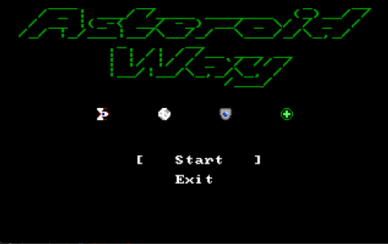

<h1 align="center">
Asteroid Way
</h1>

  

  

## 🪐 O que é o Asteroid Way?

**Asteroid Way** é um jogo desenvolvido inteiramente em Assembly 8086. Nele, o jogador controla uma nave que deve desviar e destruir asteroides em movimento, utilizando disparos e coletando itens como escudos e curas ao longo de cinco fases crescentes de dificuldade.

O jogo foi desenvolvido como projeto acadêmico, com foco em manipulação de memória de vídeo, controle de hardware via interrupções e lógica de jogo em baixo nível.

---

## 🎯 Propósito do Projeto

Este projeto tem como objetivo demonstrar a criação de um sistema interativo completo utilizando linguagem de baixo nível. O jogador pode:

- Mover a nave para cima e para baixo;
- Atirar projéteis;
- Usar itens (cura e escudo);
- Progredir por fases com aumento de dificuldade;
- Visualizar HUD com barra de vida, tempo e fase.

---

## 🕹️ Como Jogar

### ✅ Controles

- **↑ / ↓**: movimentam a nave verticalmente.
- **Espaço**: dispara projéteis.
- **Enter**: inicia o jogo.
- **Esc**: encerra o jogo.

---

## 📦 Estrutura de Memória e Rotinas

- **Linhas de código**: ~2038 (1722 efetivas)
- **Tamanho final**: 41.5 KB
- **Principais variáveis**:
  - `vida`, `nivel`, `posicao_nave`, `asteroides[]`, `timer`
- **Principais rotinas**:
  - `INICIAR_JOGO`, `CHECA_COLISAO`, `MOVE_OBJETO`
  - `BARRA_TEMPO_JOGO`, `DESENHA_ELEMENTO`, `LER_KEY`

---

## 🎓 Aprendizados

Durante o desenvolvimento, os autores exploraram:
- Manipulação direta de memória de vídeo com segmentação
- Controle de interrupções (INT 15h, 16h, 21h)
- Desenvolvimento de rotinas reutilizáveis e otimizadas
- Desafios de controle de fluxo e timers em Assembly

---

## 👨‍💻 Autores

- [Ricardo Bregalda](https://github.com/RicardoMBregalda)
- [Matheus Tregnago](https://github.com/matregnago)

---

## 📚 Referências

- [INT 15h – Clock do sistema](https://stanislavs.org/helppc/int_15.html)
- [INT 21h – Hora da BIOS](https://stanislavs.org/helppc/int_21.html)
- [INT 16h – Entrada do teclado](https://stanislavs.org/helppc/int_16.html)
